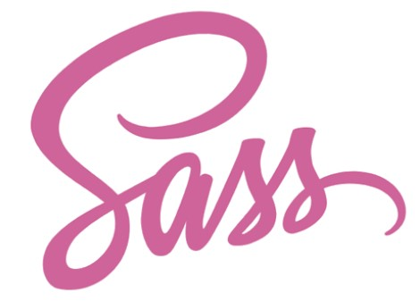
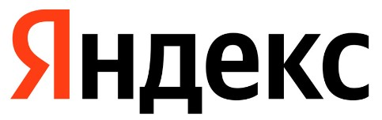
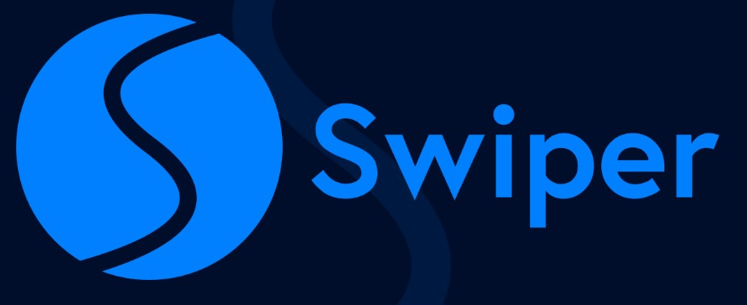
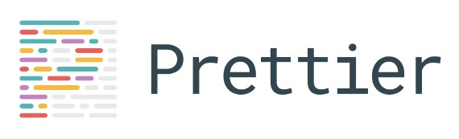
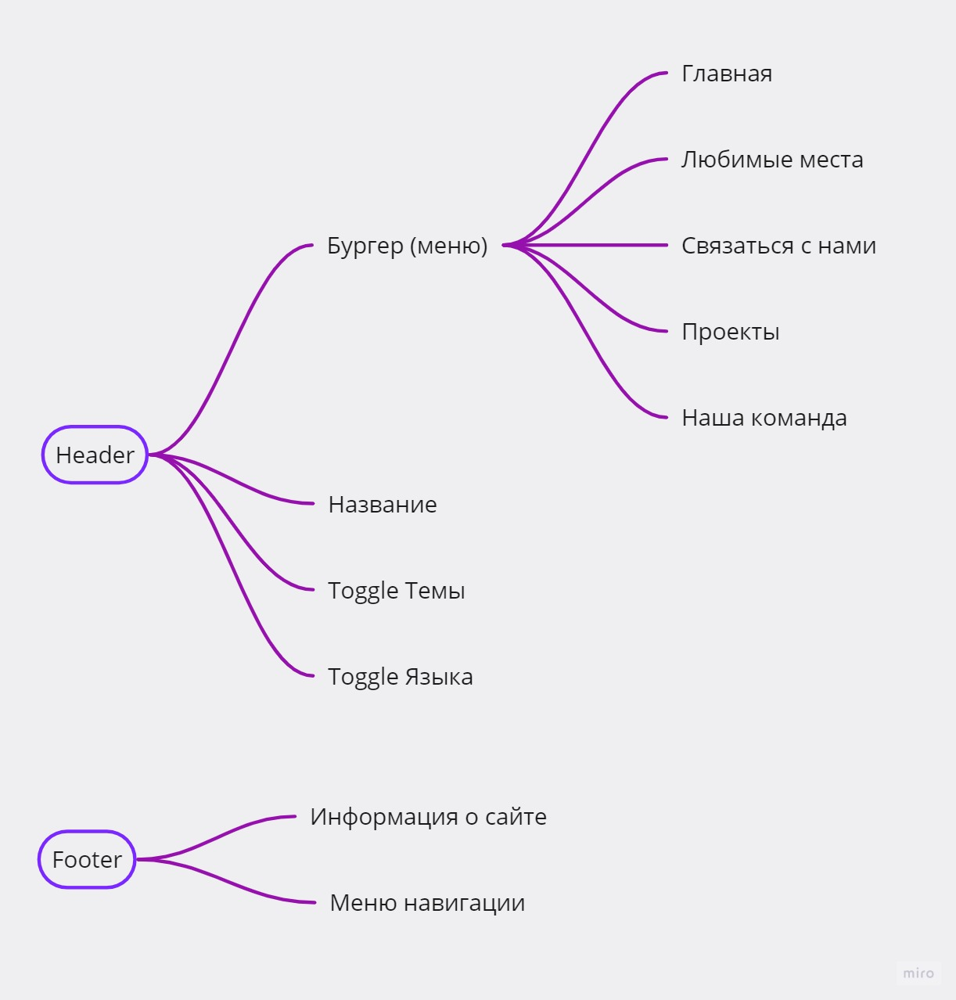
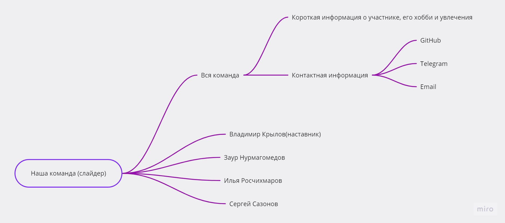
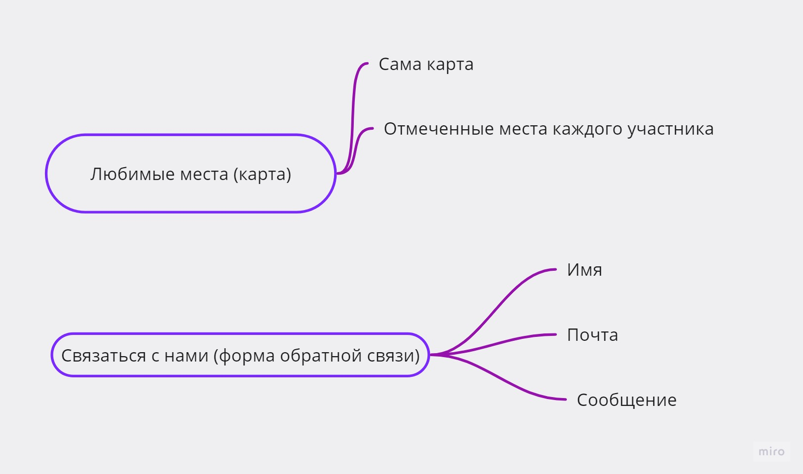
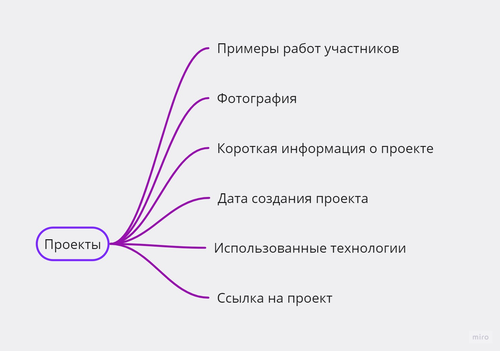

<h1 align="center">Привет, мы команда DreamTeam </h1>

## Мы ученики старших классов. Мы живем в разных уголках России, но всех нас объединяет любовь к программированию :computer: и Frontend-разработке :technologist:

 

---

<h2 align='center'> Использованные технологии </h2>

---

 

-   ### Сайт разработан с помощью библиотеки 

-   ### Собран с помощью 

-   ### Для стилей использовали  и **SCSS** 

-   ### Форма обратной связи отправляет нам сообщение в , с помощью **Telegram API**

-   ### Карты сделаанны с помощью **Yandex Maps API** 

-   ### Слайдер нашей команды реализован с помощью **Swiper.js** 

 

---

<h2 align='center'> В процессе разработке мы использовали</h2>

---

 

-   ### Для удобной совместной разработки 

-   ### Форматирование кода 

-   ### Линтер упрощает написание кода 

 

---

<h2 align='center'> Архитектура нашего сайта </h2>

---

 

### Header и Footer

 

 

### Slider Наша команда

 

 

### Наши любимые места Yandex Map и Форма для связи с нами

 

 

### Наши проекты и примеры работ

 

 

<!-- ### Сайт поднят на хостинге  -->

### Можно оценить его по [ссылке](https://yandex-dream-team.netlify.app)
